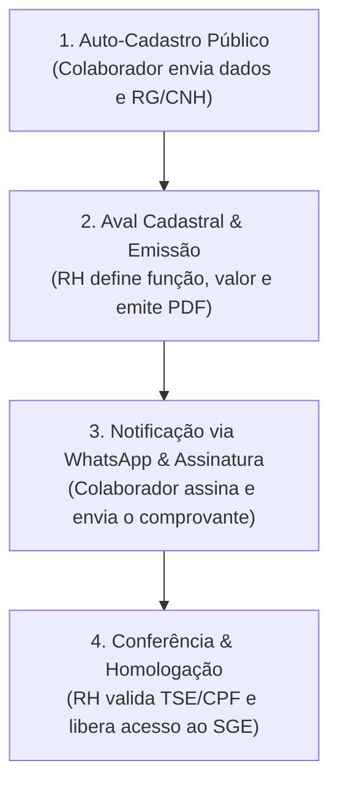

# 📘 Manual de Cadastro e Contratação de Colaboradores de Campanha (SGE)

Este manual estabelece o procedimento operacional padrão (POP) para o **Auto-Cadastro, Emissão de Contrato, Coleta de Assinatura e Homologação Cadastral** dos colaboradores da campanha eleitoral no **Sistema de Gestão Eleitoral (SGE)**.

---

> [!IMPORTANT]
> **Conformidade Legal e Eleitoral (Res. TSE nº 23.607/2019 e LGPD):**
> Todos os colaboradores contratados para prestação de serviços de campanha devem possuir contrato formal assinado, CPF em situação regular na Receita Federal e consentimento explícito (Opt-in) para tratamento de dados pessoais e comunicação via WhatsApp.

---

## 🔄 Fluxo de Contratação em 4 Etapas

---

## 📱 Etapa 1: Auto-Cadastro pelo Colaborador (Portal Público)

1. **Acesso ao Link Público:**
   * O colaborador acessa o link de cadastro disponibilizado pela campanha:
     `https://seu-dominio.com.br/colaborador/cadastro`
2. **Preenchimento dos Dados Pessoais:**
   * Nome Completo, CPF, RG e Órgão Emissor.
   * Data de Nascimento e Nome da Mãe.
   * Endereço Completo com CEP.
   * Número de Celular / WhatsApp (com DDD).
   * E-mail e Chave PIX / Dados Bancários para recebimento de honorários.
3. **Upload do Documento de Identificação:**
   * Anexar a foto ou arquivo PDF do documento oficial com foto (**RG, CNH ou CIN**).
4. **Consentimento LGPD (Opt-In):**
   * Marcar obrigatoriamente a caixa de aceite dos termos de recebimento de contratos e notificações via WhatsApp.
5. **Envio:**
   * Ao clicar em **"Finalizar Cadastro"**, o colaborador será direcionado para a tela de acompanhamento e receberá uma confirmação.

---

## 📇 Etapa 2: Análise do RH & Emissão do Contrato (Painel Administrativo)

1. **Acesso ao Painel de RH:**
   * O gestor de RH acessa no SGE: **`📇 Gestão de RH`** (`/admin/rh`).
2. **Localização do Candidato:**
   * Na tabela principal, o novo cadastro exibirá o status **`1. Aguardando Aval Cadastral`**.
   * É possível verificar o documento enviado clicando em **`🪪 Ver Documento (Foto/PDF)`**.
3. **Concessão do Aval & Emissão do Contrato:**
   * Clique no botão **`✔ Conceder Aval & Emitir Contrato`**.
   * Preencha os campos contratuais:
     * **Função na Campanha:** *(ex: Cabo Eleitoral, Coordenador de Bairro, Panfletista, Motorista)*.
     * **Valor Contratado (R$):** Valor total ajustado para o período.
     * **Forma de Pagamento:** *(ex: Transferência Bancária / PIX)*.
     * **Vigência do Contrato:** Data de Início e Data de Término.
     * **Tipo de Assinatura:** *Upload Manual (PDF/Imagem)* ou *Plataforma Externa (ZapSign/Clicksign)*.
   * Clique em **`✔ Dar Aval & Liberar Contrato`**.

> [!TIP]
> Ao confirmar o Aval, o SGE dispara automaticamente uma mensagem no WhatsApp do colaborador via Z-API contendo o **link direto para download do contrato em PDF** e o portal para envio do documento assinado.

---

## 📄 Etapa 3: Assinatura e Envio pelo Colaborador

1. **Recebimento da Mensagem via WhatsApp:**
   * O colaborador recebe a notificação no celular:
     > *"Olá [Nome]! Seu cadastro foi aprovado e seu contrato de campanha foi emitido. Clique aqui para baixar o PDF e enviar a foto/PDF assinado."*
2. **Impressão e Assinatura:**
   * O colaborador baixa o modelo oficial em PDF, realiza a impressão e assina no campo apropriado.
3. **Upload do Contrato Assinado:**
   * Pelo celular ou computador, o colaborador acessa o link tokenizado recebido, anexa a foto/PDF do contrato assinado e clica em **"Enviar Contrato Assinado"**.
4. **Atualização do Status:**
   * O status do colaborador no SGE passa para **`3. Conferir Contrato Assinado`**.

---

## ⚖️ Etapa 4: Conferência do RH, Validação TSE & Homologação Final

1. **Abertura do Modal de Homologação:**
   * No painel de RH (`/admin/rh`), clique no botão destacado **`🔍 Conferir Contrato & Homologar`**.
2. **Verificação de Documentos e Badges:**
   * Confirme a presença das sinalizações verdes na tela:
     * **`✔ RG/CNH Anexado`** ➔ Clique em *🪪 Visualizar Foto do Documento*.
     * **`✅ Contrato Assinado Enviado`** ➔ Clique em *📄 Visualizar Cópia do Contrato Assinado Enviado*.
3. **Checagem Automática da Situação Cadastral (TSE / Receita Federal):**
   * O modal executará a consulta automática do CPF:
     * **Situação do CPF:** *(Regular)*.
     * **Maioridade Legal:** *(Conformidade com a legislação de trabalho de campanha)*.
     * **Enquadramento Legal:** *(Resolução TSE nº 23.607/2019)*.
4. **Atribuição do Perfil de Acesso SGE (Nível de Permissão):**
   * Selecione a função de acesso do usuário no sistema:
     * `COLABORADOR` *(Acesso ao Portal de Campo, Relatório de Viagens e Envio de Cupons)*.
     * `FINANCEIRO` / `OPERADOR` / `ADMINISTRADOR`.
5. **Conclusão da Homologação:**
   * Clique em **`🚀 Homologar & Liberar Acesso SGE`**.

> [!NOTE]
> **Envio Automático de Credenciais:**
> Ao homologar, o SGE cria a conta de usuário, gera uma **senha provisória segura** e a envia diretamente para o WhatsApp do colaborador com o link de login do Portal do SGE.

---

## 📊 Tabela de Status do Colaborador

| Status no SGE | Significado | Próxima Ação |
| :--- | :--- | :--- |
| **`AGUARDANDO_AVAL`** | Novo auto-cadastro público realizado | RH deve conferir e emitir o contrato |
| **`AGUARDANDO_ASSINATURA_CONTRATO`** | Contrato emitido e notificado via WhatsApp | Colaborador deve assinar e enviar o arquivo |
| **`AGUARDANDO_CONFERENCIA_CONTRATO`** | Colaborador enviou o contrato assinado | RH deve realizar a homologação no modal |
| **`HOMOLOGADO`** | Colaborador aprovado com acesso liberado ao SGE | Pronto para lançamentos e atividades de campo |
| **`REJEITADO`** | Cadastro ou contrato recusado pelo RH | Necessita de correção de dados ou novo envio |

---

## 🆘 Suporte e Resolução de Problemas

* **WhatsApp não entregue:** Utilize o botão **`📲 Enviar WhatsApp (Z-API)`** na coluna de ações do painel de RH para reenviar a notificação manualmente.
* **Documento Ilegível:** O RH pode solicitar o reenvio do contrato encaminhando o link de cadastro público ao colaborador.
* **Redefinição de Acesso:** Em caso de perda de senha pelo colaborador, o administrador pode redefinir o acesso no menu `Usuários` ou reenviar o convite.
