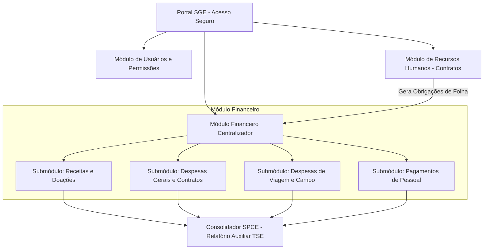
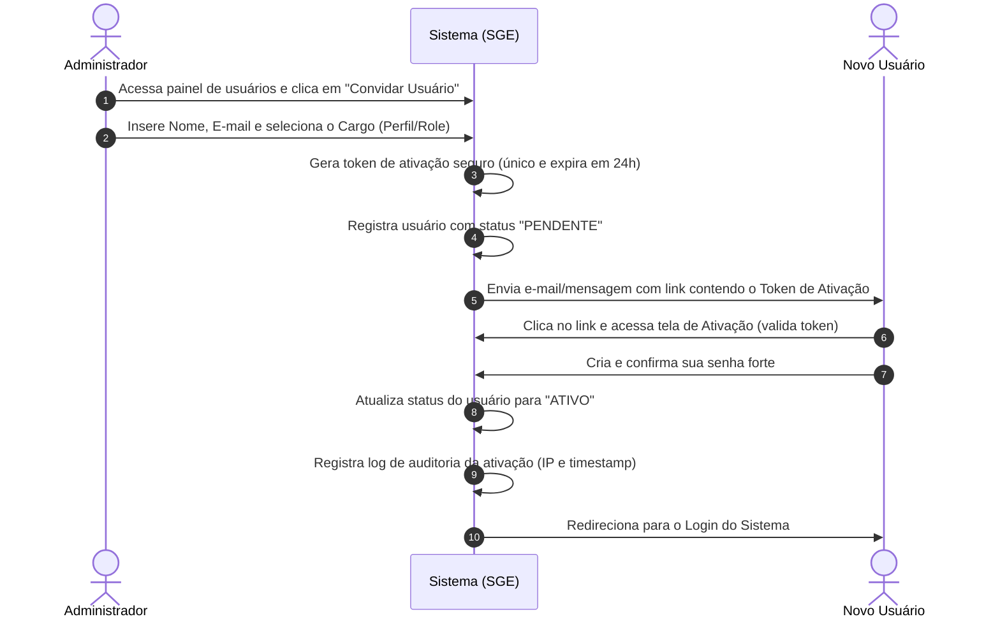
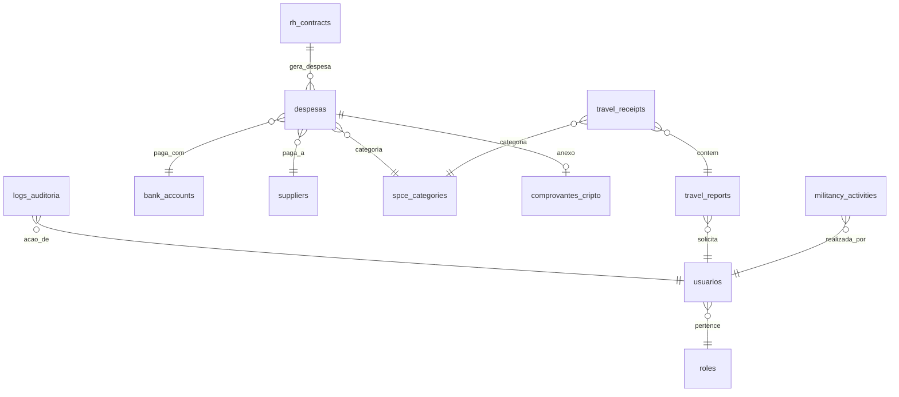
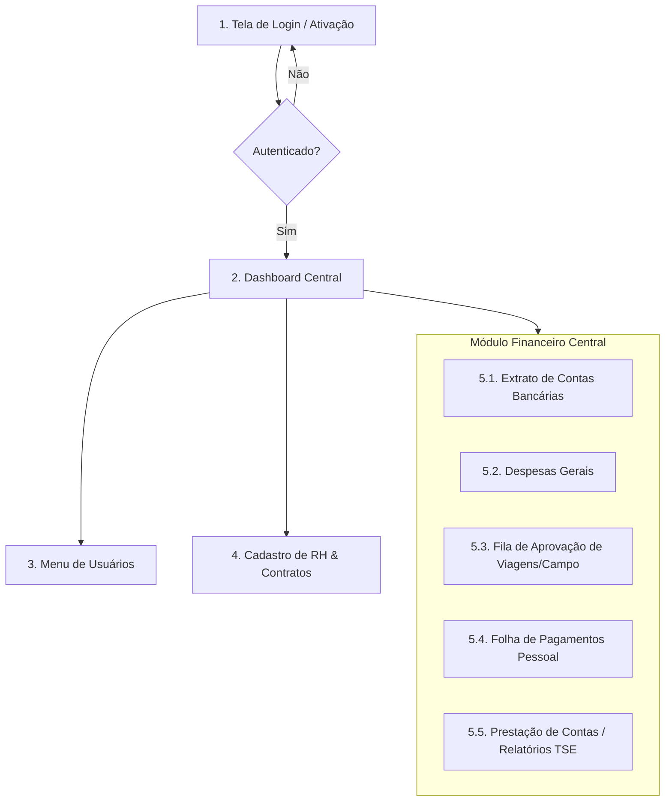

# Brainstorming e Fluxo do Projeto: Sistema de Gestão Eleitoral (SGE)

Este plano descreve a arquitetura proposta, a modelagem de dados consolidada e as especificações de segurança acordadas durante a fase de brainstorm do sistema de gestão e prestação de contas de campanhas eleitorais.

---

## 📋 Escopo Geral do Sistema (Simplificado e Consolidado)

O sistema será estruturado em dois macro-módulos principais mais o gerenciamento de RH, reduzindo a complexidade de navegação e integrando todas as saídas financeiras diretamente no fluxo de caixa da prestação de contas:

1. **Módulo de Usuários e Permissões:** Controle de acesso dinâmico por perfil (RBAC) e trilha de auditoria.
2. **Módulo de Recursos Humanos (RH):** Cadastro de colaboradores/militantes e geração dos contratos temporários exigidos pelo TSE.
3. **Módulo Financeiro Centralizador:** Centralizador de todas as movimentações de recursos, contendo os seguintes submódulos integrados:
   * **Submódulo de Receitas e Doações:** Cadastro de receitas do partido (FEFC/Fundo Partidário) e doações estimáveis/financeiras de pessoas físicas.
   * **Submódulo de Despesas de Campo / Deslocamento:** Lançamento de comprovantes de viagens, combustíveis e alimentação em trânsito com fluxo de aprovação.
   * **Submódulo de Pagamentos de Pessoal:** Processamento da folha da militância e fornecedores de serviços a partir dos contratos gerados no RH.
   * **Submódulo de Despesas Gerais:** Contratos de comitês, alugueis de veiculos, passagens aéreas, materiais gráficos (santinhos), publicidade e tarifas bancárias.

---

## ⚙️ Diretrizes de Arquitetura e Engenharia Definidas

### 1. Stack Tecnológico e Geração de Código
* **Backend:** PHP Puro (Orientado a Objetos + PDO/MySQL) estruturado de forma MVC.
* **Proibição de Código Autônomo:** O assistente atual atuará estritamente no **planejamento, design arquitetural e regras de negócio**. Nenhuma linha de código ou configuração de banco de dados ativa será escrita no repositório.

### 2. Cadastro e Administração de Usuários (RBAC)
* Tabela de permissões flexível, onde perfis de acesso podem ser criados e modificados a qualquer momento pelo Administrador.
* Rastreabilidade total (Logs de Auditoria) de todas as transações.

### 3. Controle Financeiro e Fluxo de Aprovação
* **Aprovação Unificada de Despesas:** Tanto os reembolsos de viagem/deslocamento quanto os pagamentos de pessoal passam por uma **etapa de aprovação pendente** no módulo financeiro antes de serem computados como pagos e enviados para a prestação de contas.
* **Segregação de Contas Bancárias:** Identificação clara da origem e destinação dos recursos (FEFC, Fundo Partidário e Outros Recursos).

### 4. Armazenamento Criptografado de Comprovantes
* Os comprovantes de despesas (fotos, PDFs, digitalizações) enviados em deslocamento serão armazenados no servidor web **de forma criptografada**.
* Os arquivos físicos não ficarão em pastas públicas acessíveis por URL direta. A leitura e descriptografia dos arquivos para visualização no painel financeiro serão realizadas via controlador autenticado e em tempo de execução.

### 5. Responsividade e Compatibilidade Multiplataforma (Mobile & PC)
* **Abordagem Mobile-First:** O portal do militante (upload de comprovantes, registros de panfletagem) será 100% responsivo e otimizado para celulares comuns, priorizando toques rápidos (botões com tamanho mínimo de 44x44px) e formulários verticais simples.
* **Layout Fluido para Desktop (PC):** Os painéis gerenciais e tabelas complexas do Administrador e do Financeiro se expandirão perfeitamente em telas maiores para oferecer visualização densa de tabelas, exportações SPCE e múltiplos gráficos, mantendo o controle lateral via Sidebar fixa.
* **Otimização de Upload no Celular:** Como o upload de fotos da câmera móvel consome muitos dados móveis e tempo (3G/4G), o frontend do militante compactará/redimensionará as imagens via JavaScript no próprio navegador do celular do usuário antes de iniciar o envio criptografado.

### 6. Proteção de Dados (LGPD), Criptografia Total e Backup
* **Criptografia em Nível de Aplicação (Application-Level Encryption):** No banco de dados MySQL, todas as informações pessoais identificáveis (PII) consideradas críticas e sensíveis (como `email`, `cpf`, `cnpj`, dados de `contas bancárias` e `valores`) serão armazenadas criptografadas na aplicação usando o algoritmo `AES-256-CBC` via biblioteca OpenSSL do PHP. A chave de criptografia master será gerida estritamente via variáveis de ambiente confidenciais (`.env`).
* **Rotina de Backup Diário Criptografado:** Implementação de uma rotina automática diária (via script agendado/cronjob) que gera o dump do banco de dados MySQL e consolida a pasta de uploads físicos. Todo o pacote gerado será compactado, criptografado simetricamente e enviado de forma segura para um provedor de nuvem secundário e isolado.
* **Conformidade à LGPD:**
  * **Princípio da Finalidade:** A coleta de dados limita-se exclusivamente ao exigido pela legislação eleitoral para prestação de contas (TSE).
  * **Trilha de Consentimento:** Qualquer armazenamento de dados de colaboradores conterá uma trilha registrando data, hora, IP e a aceitação dos termos de privacidade da campanha.
  * **Direito ao Acesso e Correção:** O painel administrativo permitirá a consulta e retificação rápida de qualquer dado cadastrado a pedido do titular.

### 7. Diretrizes para Integração e Mensagens via WhatsApp
* **Proibição de Disparos em Massa (Spam):** O sistema está proibido de enviar propaganda, spam ou comunicações em massa que violem os Termos de Serviço da Meta, para resguardar a integridade da conta do candidato contra banimentos que poderiam prejudicar a campanha eleitoral.
* **Notificações Estritamente Transacionais:** O canal de WhatsApp será utilizado unicamente para notificações de processos do sistema (ex: aviso de prestação de contas pendente, confirmação de recebimento de reembolso, envio de relatórios de auditoria para o administrador).
* **Double Opt-In (Confirmação Dupla):** No momento do cadastro do usuário, o sistema enviará uma primeira mensagem solicitando autorização expressa para o recebimento de alertas. O envio de alertas transacionais só iniciará se o usuário responder "SIM" ou clicar em um botão de opt-in.
* **Opt-Out Facilitado (Descadastramento):** A qualquer momento o colaborador poderá enviar a palavra "PARAR" para que o sistema registre a revogação de consentimento e suspenda imediatamente o envio de qualquer mensagem subsequente.

---

## 🔑 Fluxo de Cadastro e Ativação de Usuários (Proposta de Segurança)

Para garantir segurança máxima contra invasões ou cadastros indesejados, **não haverá link de cadastro público**. O cadastro de novos usuários seguirá um **fluxo baseado em convites (Invitation-based)**:

---

## 🗄️ Modelagem de Dados Detalhada (Esquema Físico Conceitual)

Abaixo estão descritos os campos, tipos de dados, restrições e relacionamentos para o desenvolvimento das tabelas no MySQL.

### Dicionário de Tabelas

#### 1. `roles` (Perfis de Acesso / RBAC)
* `id` (INT, Primary Key, Auto Increment)
* `name` (VARCHAR(50), Unique, Not Null) - Ex: 'ADMINISTRADOR', 'FINANCEIRO', 'COLABORADOR_CAMPO'
* `description` (VARCHAR(255))
* `permissions` (TEXT, Not Null) - JSON contendo chaves booleanas de controle de acesso (ex: `{"users_write":true, "financial_approve":true}`)
* `created_at` (TIMESTAMP, Default CURRENT_TIMESTAMP)

#### 2. `usuarios` (Usuários do Sistema)
* `id` (INT, Primary Key, Auto Increment)
* `name` (VARCHAR(100), Not Null)
* `email` (VARCHAR(100), Unique, Not Null)
* `password_hash` (VARCHAR(255), Not Null)
* `role_id` (INT, Foreign Key referencing `roles.id`, Not Null)
* `status` (ENUM('ATIVO', 'PENDENTE', 'INATIVO'), Default 'PENDENTE')
* `profile_photo_path` (VARCHAR(255), Nullable) - Foto de perfil do usuário (pode ser inserida no cadastro e alterada depois)
* `token_ativacao_hash` (VARCHAR(64), Nullable) - Hash SHA256 do token de convite
* `token_expira_em` (DATETIME, Nullable)
* `created_at` (TIMESTAMP, Default CURRENT_TIMESTAMP)
* `updated_at` (TIMESTAMP, Default CURRENT_TIMESTAMP on update)

#### 3. `bank_accounts` (Contas Bancárias de Campanha)
* `id` (INT, Primary Key, Auto Increment)
* `name` (VARCHAR(100), Not Null) - Ex: 'Banco do Brasil - Conta FEFC'
* `bank_name` (VARCHAR(100), Not Null)
* `agency` (VARCHAR(20), Not Null)
* `account_number` (VARCHAR(30), Not Null)
* `fund_type` (ENUM('FEFC', 'FUNDO_PARTIDARIO', 'OUTROS_RECURSOS'), Not Null)
* `balance` (DECIMAL(15,2), Default 0.00)
* `status` (ENUM('ATIVA', 'ENCERRADA'), Default 'ATIVA')
* `created_at` (TIMESTAMP, Default CURRENT_TIMESTAMP)

#### 4. `suppliers` (Fornecedores / Prestadores)
* `id` (INT, Primary Key, Auto Increment)
* `cnpj_cpf` (VARCHAR(20), Unique, Not Null)
* `corporate_name` (VARCHAR(255), Not Null) - Razão Social ou Nome Completo
* `trade_name` (VARCHAR(255), Nullable)
* `state_registration` (VARCHAR(50), Nullable)
* `municipal_registration` (VARCHAR(50), Nullable)
* `address` (VARCHAR(255), Nullable)
* `phone` (VARCHAR(20), Nullable)
* `email` (VARCHAR(100), Nullable)
* `status` (ENUM('REGULAR', 'INIDONEO', 'PENDENTE'), Default 'REGULAR')
* `created_at` (TIMESTAMP, Default CURRENT_TIMESTAMP)

#### 5. `spce_categories` (Categorias do Plano de Contas TSE)
* `id` (INT, Primary Key, Auto Increment)
* `code` (VARCHAR(20), Unique, Not Null) - Código no SPCE (ex: '45000' para combustíveis)
* `description` (VARCHAR(255), Not Null)
* `type` (ENUM('RECEITA', 'DESPESA'), Not Null)
* `created_at` (TIMESTAMP, Default CURRENT_TIMESTAMP)

#### 6. `despesas` (Movimentações de Saída)
* `id` (INT, Primary Key, Auto Increment)
* `description` (VARCHAR(255), Not Null)
* `supplier_id` (INT, Foreign Key referencing `suppliers.id`, Not Null)
* `bank_account_id` (INT, Foreign Key referencing `bank_accounts.id`, Not Null)
* `value` (DECIMAL(15,2), Not Null)
* `date_incurred` (DATE, Not Null)
* `payment_method` (ENUM('TRANSFERENCIA', 'PIX', 'BOLETO', 'CHEQUE', 'DINHEIRO'), Not Null)
* `status` (ENUM('PENDENTE', 'APROVADO', 'REJEITADO', 'PAGO'), Default 'PENDENTE')
* `spce_category_id` (INT, Foreign Key referencing `spce_categories.id`, Not Null)
* `user_id` (INT, Foreign Key referencing `usuarios.id`, Not Null) - Lançador
* `approved_by` (INT, Foreign Key referencing `usuarios.id`, Nullable) - Aprovador
* `approved_at` (DATETIME, Nullable)
* `created_at` (TIMESTAMP, Default CURRENT_TIMESTAMP)

#### 7. `comprovantes_cripto` (Metadados de Anexos Criptografados)
* `id` (INT, Primary Key, Auto Increment)
* `expense_id` (INT, Foreign Key referencing `despesas.id`, On Delete Cascade)
* `encrypted_file_path` (VARCHAR(255), Not Null) - Caminho no servidor local
* `original_name` (VARCHAR(255), Not Null) - Nome original enviado
* `iv` (VARCHAR(64), Not Null) - Vetor de Inicialização para descriptografia simétrica (AES-256)
* `mime_type` (VARCHAR(50), Not Null)
* `created_at` (TIMESTAMP, Default CURRENT_TIMESTAMP)

#### 8. `rh_contracts` (Contratos Temporários e Folha)
* `id` (INT, Primary Key, Auto Increment)
* `worker_name` (VARCHAR(100), Not Null)
* `cpf` (VARCHAR(14), Unique, Not Null)
* `function_name` (VARCHAR(100), Not Null)
* `salary` (DECIMAL(10,2), Not Null)
* `start_date` (DATE, Not Null)
* `end_date` (DATE, Not Null)
* `bank_name` (VARCHAR(100), Nullable)
* `bank_agency` (VARCHAR(20), Nullable)
* `bank_account` (VARCHAR(30), Nullable)
* `status` (ENUM('ATIVO', 'RESCINDIDO', 'CONCLUIDO'), Default 'ATIVO')
* `contract_path` (VARCHAR(255), Nullable) - Caminho do arquivo assinado
* `created_at` (TIMESTAMP, Default CURRENT_TIMESTAMP)

#### 9. `travel_reports` (Relatórios de Viagem de Campo)
* `id` (INT, Primary Key, Auto Increment)
* `user_id` (INT, Foreign Key referencing `usuarios.id`, Not Null)
* `purpose` (VARCHAR(255), Not Null) - Agenda/Justificativa
* `start_date` (DATE, Not Null)
* `end_date` (DATE, Not Null)
* `vehicle_plate` (VARCHAR(15), Nullable)
* `status` (ENUM('EM_ANDAMENTO', 'ENVIADO', 'APROVADO', 'REJEITADO'), Default 'EM_ANDAMENTO')
* `approved_by` (INT, Foreign Key referencing `usuarios.id`, Nullable)
* `approved_at` (DATETIME, Nullable)
* `created_at` (TIMESTAMP, Default CURRENT_TIMESTAMP)

#### 10. `travel_receipts` (Recibos Individuais de Viagem)
* `id` (INT, Primary Key, Auto Increment)
* `travel_report_id` (INT, Foreign Key referencing `travel_reports.id` on delete cascade, Not Null)
* `supplier_cnpj` (VARCHAR(20), Not Null)
* `receipt_date` (DATE, Not Null)
* `value` (DECIMAL(10,2), Not Null)
* `spce_category_id` (INT, Foreign Key referencing `spce_categories.id`, Not Null)
* `encrypted_file_path` (VARCHAR(255), Not Null)
* `iv` (VARCHAR(64), Not Null)
* `status` (ENUM('PENDENTE', 'APROVADO', 'REJEITADO'), Default 'PENDENTE')
* `notes` (TEXT, Nullable)
* `created_at` (TIMESTAMP, Default CURRENT_TIMESTAMP)

#### 11. `logs_auditoria` (Trilha de Auditoria - Imutável)
* `id` (BIGINT, Primary Key, Auto Increment)
* `user_id` (INT, Foreign Key referencing `usuarios.id` on delete set null, Nullable)
* `action` (VARCHAR(100), Not Null) - Ex: 'LOGIN_FAIL', 'APPROVE_EXPENSE', 'CREATE_CONTRACT'
* `table_name` (VARCHAR(50), Not Null)
* `record_id` (INT, Nullable)
* `old_values` (TEXT, Nullable) - JSON dos dados antigos (para update/delete)
* `new_values` (TEXT, Nullable) - JSON dos dados inseridos/novos
* `ip_address` (VARCHAR(45), Not Null)
* `user_agent` (VARCHAR(255), Not Null)
* `created_at` (TIMESTAMP, Default CURRENT_TIMESTAMP)

#### 12. `militancy_activities` (Comprovações de Atividades de Militância / Panfletagem)
* `id` (INT, Primary Key, Auto Increment)
* `user_id` (INT, Foreign Key referencing `usuarios.id`, Not Null)
* `activity_date` (DATE, Not Null)
* `description` (TEXT, Not Null) - Detalhes do local e tipo de atividade (Ex: 'Panfletagem na Praça Central')
* `encrypted_photo_path` (VARCHAR(255), Not Null) - Foto de comprovação (panfletagem/comitê) criptografada no servidor
* `iv` (VARCHAR(64), Not Null)
* `latitude` (DECIMAL(10, 8), Nullable) - Para comprovação geográfica do ato
* `longitude` (DECIMAL(11, 8), Nullable)
* `status` (ENUM('PENDENTE', 'APROVADO', 'REJEITADO'), Default 'PENDENTE')
* `created_at` (TIMESTAMP, Default CURRENT_TIMESTAMP)

---

## 🗺️ Fluxo de Navegação e Telas Sugeridas (Mockups Conceituais)

Para facilitar a aprovação dos tomadores de decisão e o desenvolvimento do frontend pelo Agent Manager, a estrutura de navegação do sistema é descrita a seguir:

### 1. Tela de Login e Ativação de Conta
* **Login:** Interface limpa e minimalista. Campo de e-mail, senha e verificação de Captcha.
* **Ativação:** Tela acessível apenas via token de convite. Solicita nome completo (imutável), e-mail (imutável) e campos de criação de senha com indicador de força da senha em tempo real.

### 2. Dashboard Central (Visão 360º)
* Painel gerencial premium.
* **Cards Informativos (KPIs):** Saldo total em caixa, saldo por conta de recursos (FEFC, Fundo Partidário, Outros), despesas pendentes de aprovação e limite legal de gastos da campanha (barra de progresso mostrando % consumida).
* **Gráfico Principal:** Gráfico de setores (pizza/rosca) dividindo as despesas pelas categorias do SPCE do TSE.
* **Tabela de Logs Rápidos:** Últimas 5 ações registradas no log de auditoria para acompanhamento rápido.

### 3. Tela de Gerenciamento de Usuários
* Listagem de usuários com filtros de pesquisa por nome, e-mail, papel e status.
* Botão **"Convidar Novo Usuário"**: Abre um modal solicitando nome, e-mail e cargo. Dispara o fluxo de envio del convite.
* Botão de edição de permissões dos papéis existentes (RBAC).

### 4. Tela de RH - Contratos de Trabalho
* Cadastro simplificado do trabalhador temporário.
* Botão **"Gerar Contrato Eleitoral"**: Abre uma pré-visualização em HTML com todas as cláusulas jurídicas obrigatórias (Lei nº 9.504/1997, art. 100-A) prontas para preenchimento. Permite exportar em PDF ou gerar link para assinatura eletrônica.

### 5. Telas do Módulo Financeiro
* **Lançamento de Despesa:** Formulário para lançamento de notas fiscais gerais de campanha, contendo o campo de upload do arquivo, seleção do fornecedor e a devida classificação de despesa SPCE.
* **Painel do Colaborador de Campo (Mobile-friendly):** Tela responsiva otimizada para smartphones (Portal do Militante):
  * **Comprovantes de Gastos:** Botão rápido para tirar foto de nota fiscal de combustível/alimentação, digitar CNPJ, valor e data. Os arquivos são criptografados no servidor.
  * **Comprovação de Militância (Panfletagem):** Seção para upload de foto no ato do serviço de militância/panfletagem. Registra opcionalmente a geolocalização (latitude e longitude) para resguardar a campanha contra acusações de candidaturas/militâncias "fantasmas" (exigência de comprovação documental perante a Justiça Eleitoral).
  * **Histórico de Envios:** Lista os últimos envios do colaborador com o respectivo status de validação jurídica/financeira ("Pendente", "Aprovado" ou "Rejeitado com observação").
* **Fila de Aprovação Financeira:** Grid exclusivo para Coordenadores. Exibe todos os comprovantes e fotos de atividades submetidos pela militância que aguardam validação jurídica/fiscal. Permite visualizar os comprovantes descriptografados em tela, aprovar (integrando à folha/caixa) ou rejeitar (comentando o motivo para o colaborador reenviar).

